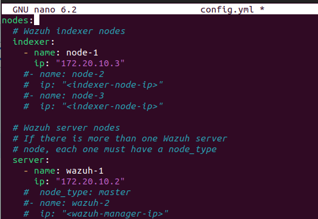

# Implantación y diseño de un sistema de detección de insiders mediante Wazuh

Este repositorio contiene los scripts y configuraciones utilizados en el desarrollo del Trabajo de Fin de Grado (TFG) centrado en el diseño y desarrollo de un sistema para detectar "insiders" (usuarios internos malintencionados) mediante la recopilación y análisis de registros del sistema y la caracterización de amenazas.

## Descripción

1) Implementación y Configuración de Wazuh: Concentración en la implementación y configuración de la herramienta Wazuh, un sistema de detección de amenazas y seguridad basada en código abierto.
2) Desarrollo de Reglas y Patrones: Formulación de reglas y patrones específicos para identificar comportamientos anómalos o acciones sospechosas realizadas por usuarios internos.
3) Integración de Inteligencia Artificial: Investigación y desarrollo de una solución que habilite la aplicación de inteligencia artificial en la identificación y caracterización de amenazas, tales como los Indicadores de Compromiso (IoC).

## Empezando 🚀

Estas instrucciones te guiarán para obtener una copia de este proyecto en funcionamiento en tu máquina local para propósitos de desarrollo y pruebas.

### Software utilizado 📋

Lista de software y herramientas utilizados, incluyendo versiones:

1. Sistemas Operativos:
•	Microsoft Windows: Windows 11 PRO v10.0.22631 tanto en equipo de trabajo como en la máquina virtual
•	GNU/Linux: Ubuntu 22.04.3 LTS
2. Virtualización/Contenedores:
•	VirtualBox


## Instalación 🔧

#### Wazuh Indexer

```bash
curl -sO https://packages.wazuh.com/4.7/wazuh-install.sh
curl -sO https://packages.wazuh.com/4.7/config.yml

```
Se debe editar el `config.yml` con el nombre de los nodos y su dirección IP.
<p align="center"></p> 

Después se ejecuta el asistente de instalación de Wazuh con la opción `--generate-config-files` para  generar la clave del clúster, los certificados y las contraseñas de Wazuh necesarios para la instalación
```bash
bash wazuh-install.sh --generate-config-files
```
Se copia el archivo llamado `wazuh-install-files.tar` en todos los servidores de la implementación distribuida, incluidos el server, el indexer y el dashboard.
Ahora para cada nodo indexador: descargamos el instalador de wazuh
```bash
curl -sO https://packages.wazuh.com/4.7/wazuh-install.sh
```
Se ejecuta el instalador de Wazuh con el nombre del nodo indexer y se inicia el cluster
```bash
bash wazuh-install.sh --wazuh-indexer <WAZUH_INDEXER_NAME>
bash wazuh-install.sh --start-cluster
```
Ahora se debe obtener la contraseña de administrador para comprobar su correcto funcionamiento:
```bash
tar -axf wazuh-install-files.tar wazuh-install-files/wazuh-passwords.txt -O | grep -P "\'admin\'" -A 1
```
Obtenida la contraseña se ejecuta lo siguiente de forma separada cambiando los valores que corresponden:
```bash
curl -k -u admin:<ADMIN_PASSWORD> https://<WAZUH_INDEXER_IP>:9200
curl -k -u admin:<ADMIN_PASSWORD> https://<WAZUH_INDEXER_IP>:9200/_cat/nodes?v
```
#### Wazuh Server

Se descarga el instalador de Wazuh en el servidor
```bash
curl -sO https://packages.wazuh.com/4.7/wazuh-install.sh
```
Y ahora se ejecuta el instalador de Wazuh con el nombre del nodo servidor , si se requieren más servidores se ejecuta el mismo comando
```bash
bash wazuh-install.sh --wazuh-server <WAZUH_SERVER_NAME>
```

#### Wazuh Dashboard

Se descarga el instalador de Wazuh en el dashboard
```bash
curl -sO https://packages.wazuh.com/4.7/wazuh-install.sh
```
Y ahora ejecutamos el instalador de Wazuh con el nombre del nodo dashboard que se especificó en el fichero `config.yml'
```bash
bash wazuh-install.sh --wazuh-dashboard <WAZUH_DASHBOARD_NAME> 
```
Después se deben obtener las contraseñas para acceder al dashboard.
```bash
tar -O -xvf wazuh-install-files.tar wazuh-install-files/wazuh-passwords.txt 
```

#### Wazuh Agent
Para instalar un agente en cualquier sistema, se requiere tener la dirección IP donde se ejecutará el agente y conocer el sistema operativo correspondiente. Una vez que se disponen de estos parámetros, desde el panel de control de Wazuh se proporciona un comando que debe ejecutarse en el agente para iniciarlo.

## Ejecutando las Pruebas ⚙️

Instrucciones y ejemplos para ejecutar el conjunto de pruebas.

```bash
# proporciona un ejemplo
```

### Pruebas de Principio a Fin 🔩

Explica qué cubren estas pruebas, por qué son importantes y cómo interpretar sus resultados.

### Pruebas de Estilo de Código ⌨️

Descripción y ejemplos de las pruebas de estilo que estás utilizando.

```bash
# proporciona un ejemplo
```

## Despliegue 📦

Instrucciones sobre cómo desplegar esto en un sistema en vivo o ambiente de producción.

## Construido Con 🛠️

Explica qué tecnologías usaste para construir este proyecto. Aquí algunos ejemplos:

- [Ruby](https://www.ruby-lang.org/es/) - El lenguaje utilizado
- [Ruby on Rails](https://rubyonrails.org) - El framework web utilizado
- [Ruby gems](https://rubygems.org) - Gestión de dependencias
- [Postgresql](https://www.postgresql.org) - Sistema de base de datos
- [Bulma IO](https://bulma.io) - Framework de CSS

## Contribuyendo 🖇️

Las contribuciones son lo que hacen a la comunidad de código abierto un lugar increíble para aprender, inspirar y crear. Cualquier contribución que hagas es muy apreciada. Por favor, lee el [CONTRIBUTING.md](https://gist.github.com/brayandiazc/xxxxxx) para detalles sobre nuestro código de conducta, y el proceso para enviarnos pull requests.

## Wiki 📖

Puedes encontrar mucho más sobre cómo usar este proyecto en nuestra [Wiki](https://github.com/your/project/wiki)

## Soporte

Si tienes algún problema o sugerencia, por favor abre un problema [aquí](https://github.com/your/project/issues).

## Roadmap

Ideas, mejoras planificadas y actualizaciones futuras

para el proyecto actual.

## Versionado 📌

Usamos [Git](https://git-scm.com) para el versionado. Para las versiones disponibles, ve las [etiquetas en este repositorio](https://github.com/your/project/tags).

## Autores ✒️

- **Brayan Diaz C** - _Trabajo inicial_ - [Brayan Diaz C](https://github.com/brayandiazc)

Mira también la lista de [contribuidores](https://github.com/your/project/contributors) que han participado en este proyecto.

## Licencia 📄

Este proyecto está bajo la Licencia XYZ - ve el archivo [LICENSE.md](LICENSE.md) para detalles

## Expresiones de Gratitud 🎁

Estamos agradecidos por las contribuciones de la comunidad a este proyecto. Si encontraste cualquier valor en este proyecto o quieres contribuir, aquí está lo que puedes hacer:

- Comparte este proyecto con otros
- Invítanos un café ☕
- Inicia un nuevo problema o contribuye con un PR
- Muestra tu agradecimiento diciendo gracias en un nuevo problema.

---

## Consejos Adicionales 📝

Aquí hay algunos consejos extra para aprovechar al máximo tu README:

- Mantén cada sección lo más concisa posible. Evita la pelusa innecesaria, ya que puede ser abrumadora para el lector.
- Asegúrate de que tus instrucciones de instalación, pruebas y despliegue sean detalladas y precisas. Si hay pasos adicionales que el lector necesita tomar (como instalar dependencias extra), asegúrate de incluirlos.
- Los visuales (imágenes, GIFs) son muy útiles para transmitir rápidamente lo que hace tu proyecto y cómo usarlo. Si puedes, incluye capturas de pantalla de tu aplicación en acción o GIFs que demuestren su uso.
- El tono amigable y acogedor que usas en tu README es excelente. Ayuda a hacer tu proyecto más acogedor para los colaboradores.
